# Disaggregated Prefill/Decode Architecture for PACE ICE Cluster

## Overview

This document describes how to implement disaggregated prefill and decode on Georgia Tech PACE ICE cluster, where inference servers run on separate compute nodes with high-speed interconnects.

## Architecture Design

### **Node Specialization**

```python
node_types = {
    'prefill_nodes': {
        'purpose': 'Process prompts and generate initial KV cache',
        'hardware': 'High compute GPUs (A100, V100)',
        'characteristics': [
            'Parallel processing of attention layers',
            'High FLOPS requirement',
            'Batch multiple prefill requests',
            'Generate and export KV cache'
        ],
        'optimal_batch_size': '8-16 requests',
        'memory_pattern': 'High compute, moderate memory'
    },
    
    'decode_nodes': {
        'purpose': 'Generate tokens sequentially using KV cache',
        'hardware': 'High memory GPUs (A6000, RTX 8000)',
        'characteristics': [
            'Sequential token generation',
            'KV cache intensive',
            'Long-running sequences',
            'Lower compute, higher memory bandwidth'
        ],
        'optimal_batch_size': '32-64 concurrent sequences',
        'memory_pattern': 'Lower compute, high memory bandwidth'
    },
    
    'hybrid_nodes': {
        'purpose': 'Handle both phases for short sequences',
        'hardware': 'Balanced GPUs (RTX 3090, A40)',
        'use_case': 'Short prompts that complete quickly'
    }
}
```

### **Communication Patterns**

```mermaid
graph TB
    Gateway[Gateway Router] --> PF1[Prefill Node 1]
    Gateway --> PF2[Prefill Node 2]
    Gateway --> PF3[Prefill Node 3]
    
    PF1 --> Cache[KV Cache Transfer]
    PF2 --> Cache
    PF3 --> Cache
    
    Cache --> DC1[Decode Node 1]
    Cache --> DC2[Decode Node 2] 
    Cache --> DC3[Decode Node 3]
    Cache --> DC4[Decode Node 4]
    
    DC1 --> Client[Client Response]
    DC2 --> Client
    DC3 --> Client
    DC4 --> Client
```



## Implementation Components

### **1. Specialized vLLM Worker Services**

#### Prefill Worker (`src/workers/prefill_worker.py`)
```python
class PrefillWorker:
    """
    Specialized worker for prompt processing phase.
    Optimized for parallel computation and KV cache generation.
    """
    
    def __init__(self, node_id: str, gpu_devices: List[int]):
        self.node_id = node_id
        self.engine_config = {
            'max_num_seqs': 16,        # Higher batch size for prefill
            'max_model_len': 4096,     # Reasonable context length
            'enable_prefix_caching': True,
            'gpu_memory_utilization': 0.9,  # High utilization for compute
            'max_num_batched_tokens': 8192,  # Large batch tokens
        }
        
    async def process_prefill(self, request: InferenceRequest) -> PrefillResult:
        """
        Process prompt and return KV cache + first token.
        """
        # 1. Process prompt through vLLM prefill
        sampling_params = SamplingParams(
            max_tokens=1,  # Only generate first token
            temperature=request.temperature
        )
        
        # 2. Extract KV cache after prefill
        kv_cache = await self.extract_kv_cache(request.request_id)
        
        # 3. Serialize cache for transfer
        serialized_cache = await self.serialize_kv_cache(kv_cache)
        
        return PrefillResult(
            request_id=request.request_id,
            first_token=first_token,
            kv_cache_data=serialized_cache,
            prompt_tokens=len(prompt_tokens),
            cache_size_bytes=len(serialized_cache)
        )
```

#### Decode Worker (`src/workers/decode_worker.py`)
```python
class DecodeWorker:
    """
    Specialized worker for token generation phase.
    Optimized for sequential generation with KV cache reuse.
    """
    
    def __init__(self, node_id: str, gpu_devices: List[int]):
        self.node_id = node_id
        self.engine_config = {
            'max_num_seqs': 64,        # Many concurrent sequences
            'max_model_len': 8192,     # Support longer sequences
            'enable_prefix_caching': True,
            'gpu_memory_utilization': 0.85,  # Leave room for KV cache
            'max_num_batched_tokens': 4096,
        }
        
    async def continue_generation(self, 
                                 request: InferenceRequest,
                                 prefill_result: PrefillResult) -> AsyncGenerator[str, None]:
        """
        Continue generation from prefill result.
        """
        # 1. Deserialize and inject KV cache
        kv_cache = await self.deserialize_kv_cache(prefill_result.kv_cache_data)
        await self.inject_kv_cache(request.request_id, kv_cache)
        
        # 2. Continue generation from where prefill left off
        sampling_params = SamplingParams(
            max_tokens=request.max_tokens - 1,  # Minus the prefill token
            temperature=request.temperature
        )
        
        # 3. Stream remaining tokens
        async for output in self.engine.generate_stream(
            request.request_id, 
            continue_from_prefill=True
        ):
            yield output.outputs[0].text
```

### **2. KV Cache Transfer System**

#### High-Performance Transfer (`src/cache/kv_transfer.py`)
```python
class KVCacheTransferManager:
    """
    High-performance KV cache transfer between nodes.
    Optimized for PACE ICE InfiniBand interconnect.
    """
    
    def __init__(self):
        self.transfer_protocol = 'rdma'  # Use RDMA over InfiniBand
        self.compression = True          # LZ4 compression for transfer
        self.checksum_validation = True  # Ensure data integrity
        
    async def transfer_cache(self, 
                           source_node: str,
                           target_node: str, 
                           cache_data: bytes) -> bool:
        """
        Transfer KV cache between nodes with optimal performance.
        """
        # 1. Compress cache data (typically 10x reduction)
        compressed_data = await self.compress_cache(cache_data)
        
        # 2. Transfer via RDMA (fastest on PACE ICE)
        transfer_start = time.time()
        
        if self.transfer_protocol == 'rdma':
            success = await self.rdma_transfer(
                source_node, target_node, compressed_data
            )
        else:
            # Fallback to TCP
            success = await self.tcp_transfer(
                source_node, target_node, compressed_data
            )
        
        transfer_time = time.time() - transfer_start
        
        # 3. Log performance metrics
        self.log_transfer_metrics(
            cache_size_mb=len(cache_data) / 1024 / 1024,
            compressed_size_mb=len(compressed_data) / 1024 / 1024,
            transfer_time_ms=transfer_time * 1000,
            bandwidth_gbps=self.calculate_bandwidth(compressed_data, transfer_time)
        )
        
        return success
        
    async def rdma_transfer(self, source: str, target: str, data: bytes) -> bool:
        """
        RDMA transfer using UCX (unified communication X) library.
        Leverages PACE ICE InfiniBand for 100+ Gbps transfers.
        """
        try:
            import ucx
            
            # Create RDMA endpoint
            ep = await ucx.create_endpoint(target, port=8888)
            
            # Direct memory transfer
            await ep.send(data)
            await ep.close()
            
            return True
        except Exception as e:
            logger.error(f"RDMA transfer failed: {e}")
            return False
    
    async def compress_cache(self, cache_data: bytes) -> bytes:
        """
        Compress KV cache data for efficient transfer.
        Uses LZ4 for high speed compression/decompression.
        """
        import lz4.frame
        
        # LZ4 provides ~10x compression with minimal CPU overhead
        return lz4.frame.compress(cache_data, compression_level=1)
```

### **3. Orchestration Layer**

#### Request Coordinator (`src/gateway/request_coordinator.py`)
```python
class DisaggregatedRequestCoordinator:
    """
    Coordinates prefill → decode handoff across nodes.
    """
    
    def __init__(self, 
                 prefill_pool: WorkerClientPool,
                 decode_pool: WorkerClientPool,
                 cache_manager: KVCacheTransferManager):
        self.prefill_pool = prefill_pool
        self.decode_pool = decode_pool
        self.cache_manager = cache_manager
        
    async def process_request(self, request: InferenceRequest) -> AsyncGenerator[str, None]:
        """
        Process request with disaggregated prefill/decode.
        """
        # 1. Route to optimal prefill node
        prefill_node = await self.select_prefill_node(request)
        
        # 2. Process prefill phase
        prefill_start = time.time()
        prefill_result = await self.prefill_pool.send_prefill_request(
            prefill_node, request
        )
        prefill_time = time.time() - prefill_start
        
        # 3. Select optimal decode node
        decode_node = await self.select_decode_node(request, prefill_result)
        
        # 4. Transfer KV cache if needed
        if prefill_node != decode_node:
            transfer_success = await self.cache_manager.transfer_cache(
                prefill_node, decode_node, prefill_result.kv_cache_data
            )
            if not transfer_success:
                raise Exception("Cache transfer failed")
        
        # 5. Continue generation on decode node
        async for token in self.decode_pool.send_decode_request(
            decode_node, request, prefill_result
        ):
            yield token
            
        # 6. Log performance metrics
        self.log_disaggregation_metrics(
            prefill_time_ms=prefill_time * 1000,
            transfer_time_ms=getattr(prefill_result, 'transfer_time_ms', 0),
            total_latency_improvement=self.calculate_improvement()
        )
```

## PACE ICE Specific Optimizations

### **1. SLURM Integration**

#### Dynamic Node Allocation (`scripts/slurm_launcher.py`)
```python
class SLURMNodeManager:
    """
    Manage dynamic allocation of prefill and decode nodes via SLURM.
    """
    
    def __init__(self):
        self.prefill_partition = 'gpu-a100'    # High compute nodes
        self.decode_partition = 'gpu-rtx'      # High memory nodes
        
    async def allocate_prefill_nodes(self, count: int) -> List[str]:
        """
        Allocate prefill nodes from A100 partition.
        """
        job_script = f"""
#!/bin/bash
#SBATCH --partition={self.prefill_partition}
#SBATCH --nodes={count}
#SBATCH --ntasks-per-node=1
#SBATCH --gres=gpu:1
#SBATCH --time=1:00:00
#SBATCH --job-name=prefill_workers

# Launch prefill workers
python -m src.workers.prefill_worker --node-id $SLURM_PROCID
        """
        
        job_id = await self.submit_job(job_script)
        return await self.get_allocated_nodes(job_id)
    
    async def allocate_decode_nodes(self, count: int) -> List[str]:
        """
        Allocate decode nodes from high-memory partition.
        """
        # Similar implementation for decode nodes
        pass
```

### **2. InfiniBand Optimization**

```bash
# Enable RDMA optimizations on PACE ICE
export UCX_NET_DEVICES=mlx5_0:1
export UCX_RNDV_SCHEME=put_zcopy
export UCX_TLS=rc_mlx5,ud_mlx5,mm,shm

# Optimize for large transfers
export UCX_RNDV_THRESH=8192
export UCX_MAX_RNDV_RAILS=1
```

### **3. Shared Filesystem Cache**

#### Persistent Cache Storage (`src/cache/pace_cache.py`)
```python
class PACECacheStorage:
    """
    Use PACE ICE shared filesystem for persistent KV cache storage.
    """
    
    def __init__(self):
        self.cache_root = "/storage/coda1/p-gburdell3/cache"  # Shared storage
        self.compression = True
        
    async def store_cache(self, 
                         request_id: str, 
                         cache_data: bytes) -> str:
        """
        Store KV cache on shared filesystem for cross-node access.
        """
        cache_path = f"{self.cache_root}/{request_id}.cache"
        
        # Compress and store
        if self.compression:
            cache_data = lz4.compress(cache_data)
            
        async with aiofiles.open(cache_path, 'wb') as f:
            await f.write(cache_data)
            
        return cache_path
    
    async def load_cache(self, cache_path: str) -> bytes:
        """
        Load KV cache from shared filesystem.
        """
        async with aiofiles.open(cache_path, 'rb') as f:
            cache_data = await f.read()
            
        if self.compression:
            cache_data = lz4.decompress(cache_data)
            
        return cache_data
```

## Performance Benefits

### **Expected Improvements**

```python
disaggregation_benefits = {
    'latency_reduction': {
        'prefill_specialization': '2-3x faster prompt processing',
        'decode_specialization': '40-60% faster token generation',
        'parallel_processing': '5-10x throughput increase'
    },
    
    'resource_utilization': {
        'compute_efficiency': '80-90% GPU utilization on prefill nodes',
        'memory_efficiency': '70-85% memory utilization on decode nodes', 
        'cost_reduction': '30-50% reduction in total compute cost'
    },
    
    'scalability': {
        'independent_scaling': 'Scale prefill and decode separately',
        'burst_handling': 'Handle 10x traffic spikes',
        'multi_model': 'Run different models on specialized hardware'
    }
}
```

### **Measurement and Monitoring**

```python
class DisaggregationMetrics:
    """
    Comprehensive metrics for disaggregated architecture.
    """
    
    def track_request_flow(self, request_id: str):
        return {
            'prefill_latency_ms': self.measure_prefill_time(),
            'cache_transfer_time_ms': self.measure_transfer_time(),
            'decode_latency_ms': self.measure_decode_time(),
            'total_latency_ms': self.measure_total_time(),
            'cache_hit_rate': self.calculate_cache_hits(),
            'resource_utilization': self.measure_gpu_utilization(),
            'cost_per_token': self.calculate_cost_efficiency()
        }
```

This disaggregated architecture leverages PACE ICE's strengths:
- **InfiniBand**: 100+ Gbps for fast cache transfer
- **Diverse Hardware**: Use A100s for prefill, RTX for decode
- **SLURM**: Dynamic resource allocation
- **Shared Storage**: Persistent cache storage

Would you like me to implement any specific component or focus on a particular aspect of this disaggregated system?