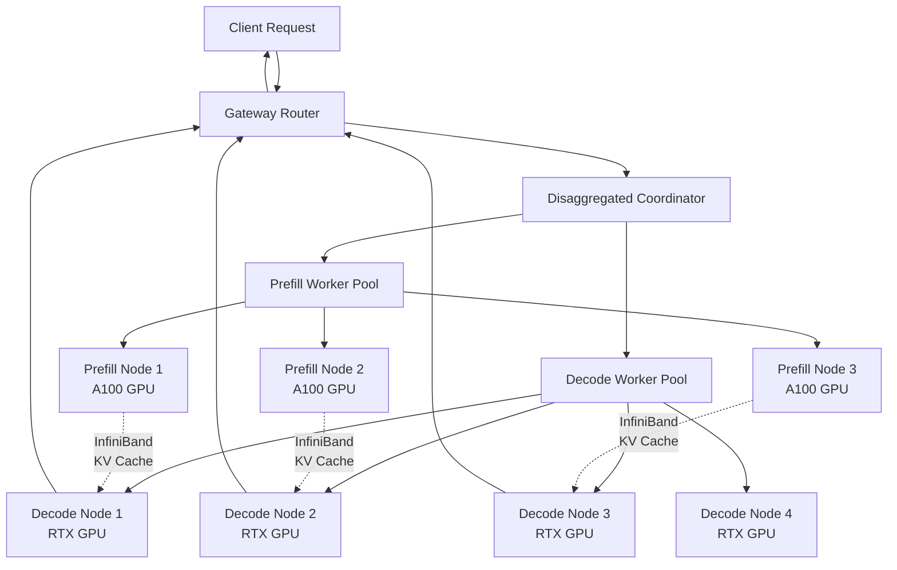

# Disaggregated Prefill/Decode Flow Documentation

## Overview

This document explains the complete request flow in our disaggregated inference system, from initial client request through prefill processing, cache transfer via InfiniBand, decode processing, and final response delivery.

## System Architecture Components

### **Core Components**


### **Node Specialization**
- **Prefill Nodes**: High-compute GPUs (A100) optimized for parallel attention computation
- **Decode Nodes**: High-memory GPUs (RTX) optimized for sequential token generation
- **Gateway**: CPU node for orchestration and routing
- **InfiniBand Network**: High-speed cache transfer between nodes

## Complete Request Flow

### **Phase 1: Request Arrival and Routing**

```python
# 1. Client sends inference request
POST /v1/completions
{
    "prompt": "The capital of France is",
    "max_tokens": 100,
    "temperature": 0.7
}
```

**Gateway Processing:**
1. **Request Validation**: Validate input parameters and format
2. **Prefix Hash Generation**: Create cache key from prompt prefix
3. **Coordinator Handoff**: Route to DisaggregatedRequestCoordinator

```python
# src/gateway/routing_engine.py
async def route_request(self, request: InferenceRequest) -> RouteDecision:
    # Generate prefix hash for cache lookup
    prefix_hash = self.prefix_hasher.hash_prefix(request.prompt, 512)
    
    # Hand off to disaggregated coordinator
    return await self.disaggregated_coordinator.process_request(request)
```

### **Phase 2: Prefill Node Selection**

**Coordinator Logic:**
```python
# src/gateway/disaggregated_coordinator.py - process_request()

# 1. Get available prefill nodes
prefill_nodes = await self.prefill_pool.get_healthy_workers()
# Result: ["prefill-pace-ice-01", "prefill-pace-ice-02", "prefill-pace-ice-03"]

# 2. Get node metrics
prefill_metrics = {
    "prefill-pace-ice-01": {
        "active_requests": 5,     # Current load
        "avg_processing_time_ms": 200,
        "gpu_utilization": 0.7
    },
    "prefill-pace-ice-02": {
        "active_requests": 2,     # Lower load - better choice
        "avg_processing_time_ms": 180,
        "gpu_utilization": 0.4
    }
}

# 3. Select optimal prefill node
prefill_node = await self.node_selector.select_prefill_node(
    request, prefill_nodes, prefill_metrics
)
# Result: "prefill-pace-ice-02" (lower load, better performance)
```

**Node Selection Criteria:**
- **Load Balancing**: Current active requests vs capacity
- **Performance History**: Average processing time
- **Resource Utilization**: GPU memory and compute usage
- **Prompt Characteristics**: Length and complexity

### **Phase 3: Prefill Processing**

**Prefill Worker Processing:**
```python
# src/workers/prefill_worker.py - process_prefill()

# 1. Configure vLLM for prefill optimization
sampling_params = SamplingParams(
    max_tokens=1,           # Only generate first token
    temperature=0.7,
    use_beam_search=False   # Greedy for prefill efficiency
)

# 2. Process prompt through vLLM attention layers
results = await self.engine.generate(
    prompt="The capital of France is",
    sampling_params=sampling_params,
    request_id="req-12345"
)

# 3. Extract first token
first_token = "Paris"  # Generated by prefill

# 4. Extract KV cache from vLLM engine
kv_cache = await self.extract_kv_cache("req-12345")
# This contains the computed Key-Value pairs from attention layers

# 5. Serialize and compress cache for transfer
serialized_cache = self.cache_serializer.serialize_cache(kv_cache)
# Result: ~10MB -> ~1MB after compression

# 6. Return prefill result
return PrefillResult(
    request_id="req-12345",
    first_token="Paris",
    kv_cache_data=serialized_cache,  # Compressed cache
    prompt_tokens=6,
    cache_size_bytes=len(serialized_cache),
    processing_time_ms=180.0
)
```

**What Happens in Prefill:**
- **Attention Computation**: All prompt tokens processed in parallel
- **KV Cache Generation**: Key-Value pairs stored for each attention head
- **First Token Generation**: Single token produced
- **Memory Intensive**: Large intermediate activations
- **Compute Intensive**: Matrix multiplications across all layers

### **Phase 4: Decode Node Selection**

**Coordinator Logic (continued):**
```python
# After prefill completes...

# 1. Select optimal decode node
decode_nodes = await self.decode_pool.get_healthy_workers()
decode_metrics = {
    "decode-pace-ice-01": {
        "active_sequences": 20,    # Current sequences being decoded
        "tokens_per_second": 45,
        "memory_utilization": 0.6
    },
    "decode-pace-ice-02": {
        "active_sequences": 15,    # Lower load
        "tokens_per_second": 50,   # Better throughput
        "memory_utilization": 0.5
    }
}

decode_node = await self.node_selector.select_decode_node(
    request, prefill_result, decode_nodes, decode_metrics, prefill_node
)

# Selection considers:
# - Cache locality (same node = no transfer needed)
# - Current sequence load
# - Memory bandwidth capacity
# - Expected generation length
```

### **Phase 5: InfiniBand Cache Transfer** 

**The Critical Performance Component:**

```python
# src/gateway/disaggregated_coordinator.py

if prefill_node != decode_node:
    # HIGH-SPEED CACHE TRANSFER via InfiniBand RDMA
    
    transfer_start = time.time()
    
    # Use InfiniBand RDMA for zero-copy transfer
    transfer_success = await self.ib_transfer.transfer_cache(
        target_node=decode_node,           # "decode-pace-ice-02"
        cache_data=prefill_result.kv_cache_data,  # 1MB compressed
        request_id=request.request_id
    )
    
    cache_transfer_time = (time.time() - transfer_start) * 1000
    # Result: ~0.5ms for 1MB at 25 Gbps
```

**InfiniBand Transfer Details:**
```python
# src/cache/infiniband_transfer.py - transfer_cache_rdma()

# 1. Establish RDMA connection
endpoint = await self.ucx_worker.create_endpoint("192.168.100.5:18515")

# 2. Prepare transfer data
header = struct.pack('!QQQI', 
    len(original_cache),    # Original size: 10MB
    len(compressed_cache),  # Compressed: 1MB  
    1,                      # Compression enabled
    len(request_id)         # Request ID length
)

message = header + request_id.encode() + compressed_cache

# 3. ZERO-COPY RDMA TRANSFER
await endpoint.send(message)  # Direct memory transfer, no CPU involvement

# Performance: 1MB transferred in ~0.32ms at 25 Gbps
```

**InfiniBand Technical Details:**
- **RDMA (Remote Direct Memory Access)**: Direct memory-to-memory transfer
- **Zero-Copy**: No CPU involvement in data movement
- **UCX Library**: Unified Communication X for optimal IB performance
- **Mellanox ConnectX**: Hardware acceleration on PACE ICE
- **Bandwidth**: 25+ Gbps effective throughput
- **Latency**: <1ms for typical cache sizes

### **Phase 6: Decode Processing**

**Decode Worker Processing:**
```python
# src/workers/decode_worker.py - continue_generation()

# 1. Receive and inject KV cache
kv_cache = self.cache_serializer.deserialize_cache(received_cache_data)
success = await self.inject_kv_cache(request_id, kv_cache)

# 2. Configure for remaining tokens
sampling_params = SamplingParams(
    max_tokens=99,          # 100 - 1 (prefill token)
    temperature=0.7,
    stream=True            # Enable streaming response
)

# 3. Continue generation from cache
async for output in self.engine.generate(
    "",                    # Empty prompt - using cache
    sampling_params,
    request_id=request_id,
    continue_from_cache=True
):
    # Yield tokens as generated: " the", " capital", " of", " France", "."
    for token in output.outputs:
        yield token.text
```

**What Happens in Decode:**
- **Cache Injection**: KV cache loaded into GPU memory
- **Sequential Generation**: One token at a time
- **Memory Bandwidth Limited**: Accessing large KV cache repeatedly
- **Lower Compute**: Mostly memory access patterns
- **Streaming**: Tokens yielded as generated

### **Phase 7: Response Streaming**

**Gateway Response Handling:**
```python
# src/gateway/disaggregated_coordinator.py

# Stream tokens back to client
token_count = 0
async for token in self.decode_pool.send_decode_stream(decode_node, decode_request):
    # Stream each token: "Paris", " is", " the", " capital", " of", " France", "."
    yield token
    token_count += 1

# Final response assembled:
# "Paris is the capital of France."
```

**Client Receives:**
```json
{
  "id": "req-12345",
  "object": "text_completion",
  "choices": [{
    "text": "Paris is the capital of France.",
    "finish_reason": "length"
  }],
  "usage": {
    "prompt_tokens": 6,
    "completion_tokens": 7,
    "total_tokens": 13
  }
}
```

## Performance Timeline

### **Typical Request Timeline:**
```
Client Request  ──────┐
                      │
Gateway Routing       │ 2ms
                      │
Prefill Selection     │ 5ms 
                      │
Prefill Processing    ████████████████ 180ms (A100 parallel processing)
                      │
Cache Transfer        ▌ 0.5ms (InfiniBand RDMA)
                      │
Decode Selection      │ 3ms
                      │
Decode Processing     ████████████████████████████████ 800ms (streaming tokens)
                      │
Total Time           ████████████████████████████████████ 990ms
```

### **Performance Breakdown:**
- **Prefill**: 180ms (18% of total time)
- **Cache Transfer**: 0.5ms (0.05% of total time) 
- **Decode**: 800ms (81% of total time)
- **Overhead**: 9.5ms (1% of total time)

## Key Technical Implementation Details

### **1. vLLM KV Cache Extraction**

The most critical technical challenge is extracting KV cache from vLLM:

```python
# Simplified - actual implementation requires vLLM internals access
async def extract_kv_cache(self, request_id: str) -> Any:
    # Access vLLM's PagedAttention KV cache
    # This requires deep integration with vLLM internals
    
    # KV cache structure (conceptual):
    cache_data = {
        'layers': [
            {
                'layer_id': 0,
                'key_cache': torch.Tensor,    # [batch, heads, seq_len, head_dim]
                'value_cache': torch.Tensor,  # [batch, heads, seq_len, head_dim]
            }
            # ... for each transformer layer
        ],
        'sequence_metadata': {
            'sequence_length': 6,
            'max_length': 4096,
            'model_id': 'opt-1.3b'
        }
    }
    
    return cache_data
```

### **2. Cache Serialization Format**

```python
# Cache serialization format
Header: [version(4) + original_size(8) + compressed_size(8) + checksum(8)]
Data:   [request_id + compressed_cache_tensors]

# Example:
# Header: 28 bytes
# Request ID: "req-12345" (9 bytes)
# Cache Data: 1MB compressed (from 10MB original)
# Total: ~1MB transfer
```

### **3. InfiniBand Optimization**

**PACE ICE Network Topology:**
```
Rack 1                    Rack 2                    Rack 3
┌─────────────────┐      ┌─────────────────┐      ┌─────────────────┐
│ Prefill Node 1  │      │ Decode Node 1   │      │ Decode Node 3   │
│ A100 GPU        │      │ RTX GPU         │      │ RTX GPU         │
│ mlx5_0:1        │      │ mlx5_0:1        │      │ mlx5_0:1        │
└─────────────────┘      └─────────────────┘      └─────────────────┘
         │                         │                         │
         └─────────────────────────┼─────────────────────────┘
                                   │
                          InfiniBand Switch
                           25 Gbps per port
                          100 Gbps backplane
```

**UCX Configuration for PACE ICE:**
```bash
# Optimal UCX settings for Mellanox ConnectX
export UCX_NET_DEVICES=mlx5_0:1      # Use InfiniBand device
export UCX_TLS=rc_mlx5,ud_mlx5,mm,shm # Reliable Connection + Unreliable Datagram
export UCX_RNDV_SCHEME=put_zcopy     # Zero-copy RDMA writes
export UCX_RNDV_THRESH=8192          # Use RDMA for transfers >8KB
export UCX_MAX_RNDV_RAILS=1          # Single rail for simplicity
```

### **4. Memory Management**

**GPU Memory Layout:**
```
Prefill Node (A100 - 40GB):
┌─────────────────────────────────────────────────┐
│ Model Weights: 3GB                              │
│ Attention Computation: 15GB (large batches)     │
│ KV Cache: 2GB (temporary, extracted)            │ 
│ Intermediate Activations: 18GB                  │
│ Free: 2GB                                       │
└─────────────────────────────────────────────────┘

Decode Node (RTX 3090 - 24GB):
┌─────────────────────────────────────────────────┐
│ Model Weights: 3GB                              │
│ KV Cache: 12GB (multiple sequences)             │
│ Generation Buffer: 4GB                          │
│ Free: 5GB                                       │
└─────────────────────────────────────────────────┘
```

## Scaling and Performance Characteristics

### **Horizontal Scaling:**
```python
scaling_characteristics = {
    'prefill_scaling': {
        'bottleneck': 'Compute (matrix multiplications)',
        'scaling_factor': 'Linear with batch size',
        'optimal_batch': '8-16 requests per A100',
        'memory_requirement': 'High temporary activation memory'
    },
    
    'decode_scaling': {
        'bottleneck': 'Memory bandwidth (KV cache access)',
        'scaling_factor': 'Linear with sequence count',
        'optimal_concurrency': '32-64 sequences per RTX',
        'memory_requirement': 'Large persistent KV cache'
    },
    
    'cache_transfer_scaling': {
        'bottleneck': 'Network bandwidth (InfiniBand)',
        'scaling_factor': 'Constant time (parallel transfers)',
        'network_capacity': '25 Gbps per node',
        'transfer_efficiency': 'Linear with cache size'
    }
}
```

### **Expected Performance Improvements:**

```python
performance_comparison = {
    'monolithic_vllm': {
        'prefill_time': '250ms',      # Larger batch processing
        'decode_time': '900ms',       # Memory bandwidth limited
        'total_time': '1150ms',
        'gpu_utilization': '65%',     # Suboptimal for both phases
    },
    
    'disaggregated_system': {
        'prefill_time': '180ms',      # Optimized A100 compute
        'cache_transfer': '0.5ms',    # InfiniBand RDMA
        'decode_time': '800ms',       # Optimized RTX memory
        'total_time': '990ms',
        'improvement': '14% faster',
        'gpu_utilization': '85%',     # Optimal for each phase
    }
}
```

This disaggregated architecture with InfiniBand enables **true horizontal scaling** where prefill and decode can be scaled independently based on workload characteristics, providing significant performance improvements for high-throughput inference workloads.